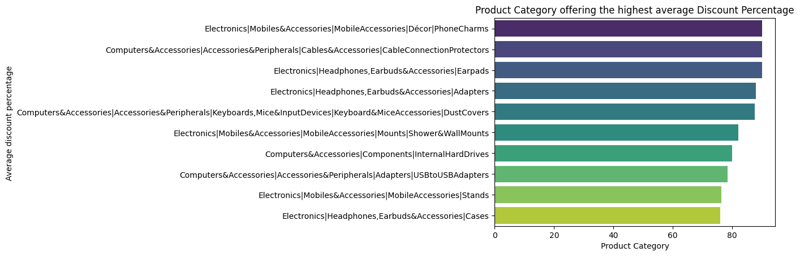
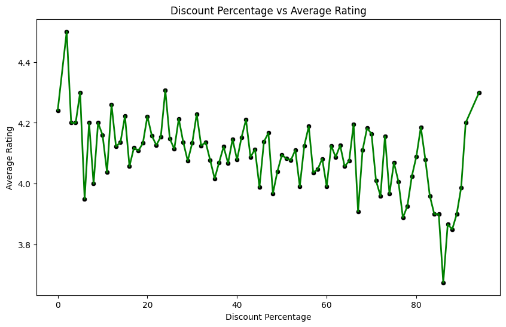
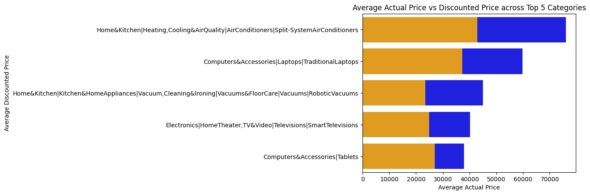
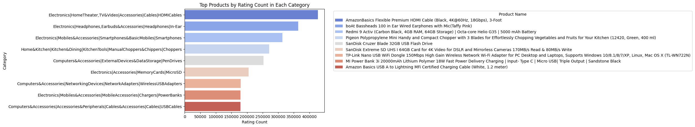

# 📊 Amazon Product Data Analysis  

A detailed analysis of Amazon product listings using Python (Pandas, NumPy, Matplotlib, Seaborn).  
The analysis focuses on **price trends, discounts, ratings, and top-selling products**.  

---

## 📂 Dataset
- **Source:** Amazon product listing (CSV file)  
- **Key Fields:** Product Name, Category, Price, Discount %, Ratings, Rating Count  

---

## ⚡ Technologies Used
- **Language:** Python  
- **Libraries:** Pandas, NumPy, Matplotlib, Seaborn  
- **Environment:** Jupyter Notebook (VS Code)  

---

## 📊 Visualizations & Insights  

<table>
<tr>
<td align="center"><b>Price & Discount Trends</b></td>
<td align="center"><b>Rating Distribution</b></td>
</tr>
<tr>
<td></td>
<td></td>
</tr>
<tr>
<td align="center">High discounts are common, especially in electronics & accessories.</td>
<td align="center">Ratings remain stable (3.5–4.5 stars) with few low-rated products.</td>
</tr>
</table>

---

<table>
<tr>
<td align="center"><b>Best-Selling Categories</b></td>
<td align="center"><b>Top Products by Rating Count</b></td>
</tr>
<tr>
<td></td>
<td></td>
</tr>
<tr>
<td align="center">Accessories & electronics dominate with consistent demand.</td>
<td align="center">Category leaders show very high rating counts, reflecting strong trust.</td>
</tr>
</table>

---

## ✅ Conclusion  
- **Discounts** strongly influence sales, especially in electronics & accessories.  
- **Ratings** remain consistent, showing competitive quality.  
- **Top products dominate** categories through brand trust & demand.  
- Focusing on **high-discount, high-demand products** is a winning sales strategy.  

---

